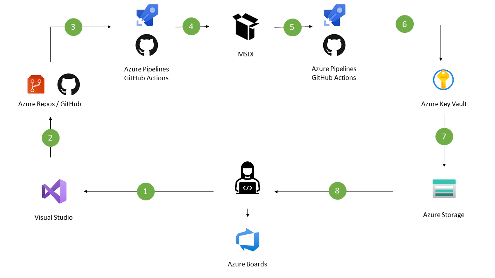

# Simple CRUD stack
Check stacks for a simple CRUD, then document it and make it work. Simple test for future work. Following considerations are made:

## Cost
First of all, the stack should be free. If it is not free, it should be cheap.
## Web/Desktop app
End user web app, using a simple web stack. The stack is a simple CRUD, with a web app, a database and a backend. Another option is Electron app, simple desktop app with a simple web to show inventory and data about bussiness.

## Frontend
For the sake of simplicity, Django will be used for the frontend. Django is a Python framework, and it is easy to use. It is also easy to deploy, and it is a good choice for a simple web app, it is worth to give it a try to electron and if it scales it can be switched to Django or React easily. In the same way if app grows, it can be changed to a more robust backend.

## Database
For this example SQLite can fullfill all the requeriments. As project gets more serius, it can be changed to a more robust database and free like Azure Cosmos DB. 

## Backend
Django and Electron can accomplish the backend requeriments. If the app grows, it can be changed to a more robust backend.

## Hosting and deployment
In order to keep it simple and free, the app will be deployed to Azure App Service. It is free, and it is easy to use. 
## CI/CD
This could be achived with GitHub Actions. It is easy to use, and it is free as project is public. We can use GitHub actions to CI/CD both Web apps and Desktop apps, last ones require extra steps using MSIX using following architecture.

